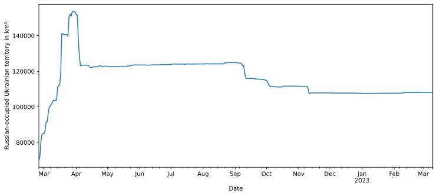
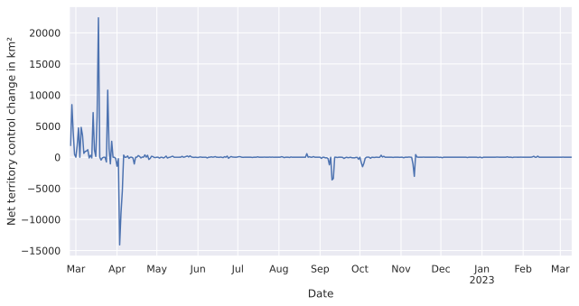
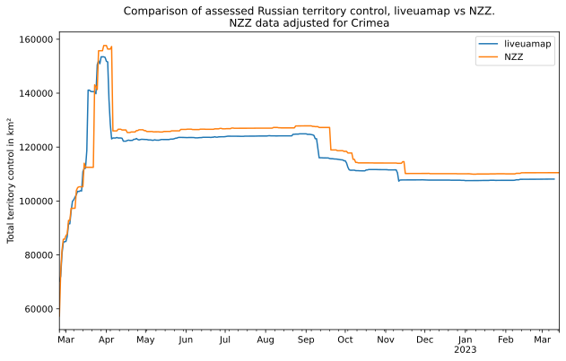
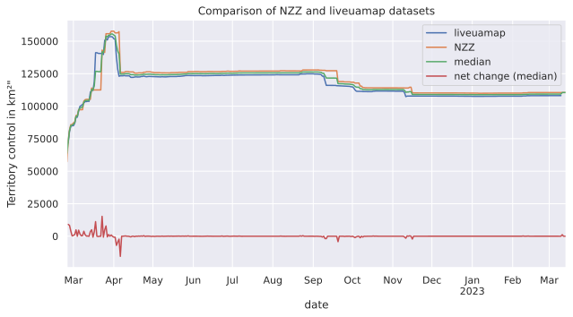
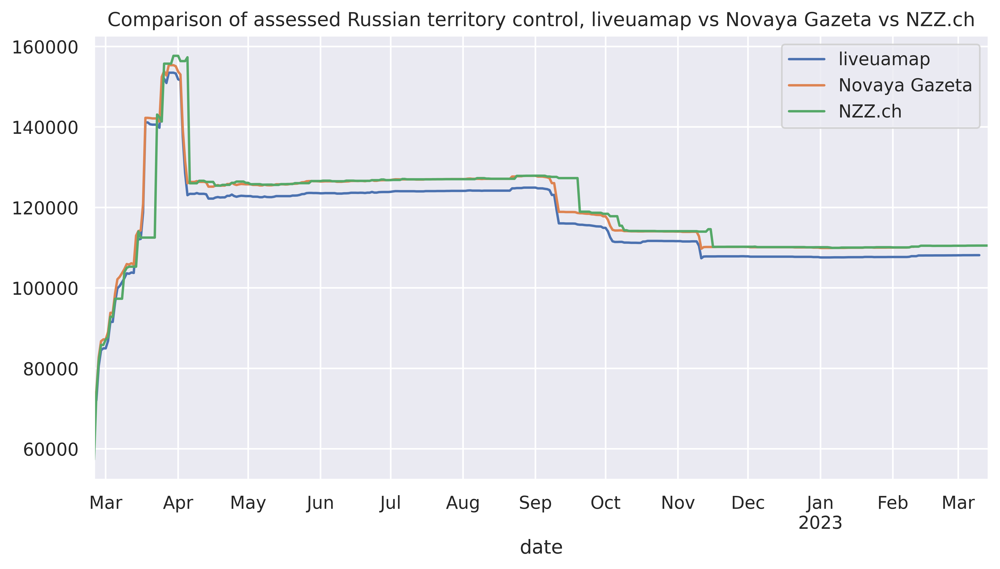
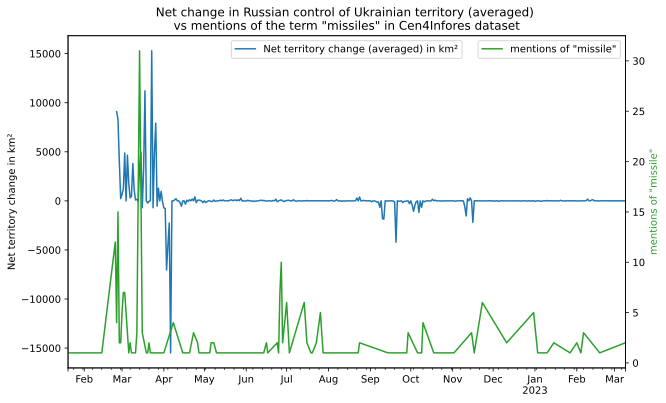
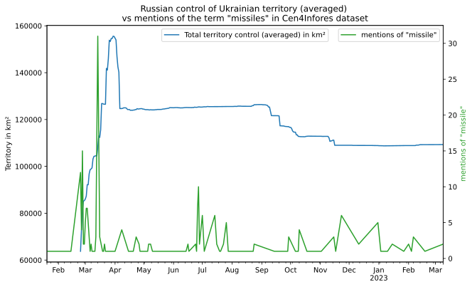

# Territory control via liveuamap

**TL;DR:** Download [territory.csv](territory.csv) for daily Russian control of
Ukrainian territory figures.

Areas already occupied pre-2022 (Crimea, "DNR", "LNR") are included in
computations.

### Preparation
Install dependencies via `pip install -r requirements.txt`.

For map visualizations in the jupyter notebook, install `ipyleaflet` and
`ipywidgets`.

### Scraping the data
Run `python scrape.py`. Scraped items will appear as `.json` in the `data/`
folder.

### Computing territory
Run `python update_csv.py`. The `territory.csv` file is automatically updated
once a day via GitHub actions.

### Analysis

See the accompanying ipython jupyter notebook:
[liveuamap_territory.ipynb](liveuamap_territory.ipynb)

### License

`stanford.json` from file "National Boundary, Ukraine, 2015" by Hijmans, Robert
J. and University of California, Berkeley. Museum of Vertebrate Zoology.
Downloaded from [geodata.lib.utexas.edu](https://geodata.lib.utexas.edu/catalog/stanford-nv937bq8361)

Data from liveuamap, in addition to own calculations from data based on analysis
of [NZZ.ch maps](https://github.com/conflict-investigations/nzz-maps) and Centre
for Information Resilience datasets, also
[Novaya Gateta](https://novayagazeta.eu/articles/2023/02/28/dead-end-en).

Do whatever you like with it, but give credit to the original authors of the
datasets.
